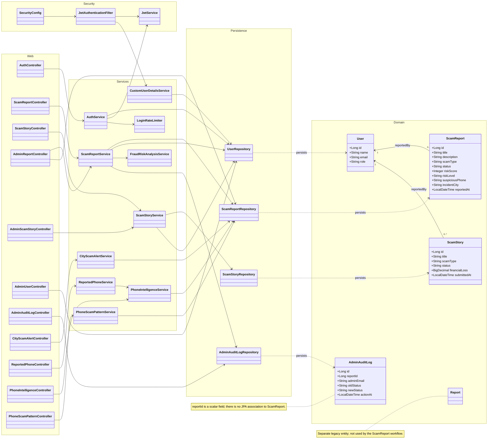

# ScamShield class diagram

The diagram focuses on the application layers and core domain relationships. Supporting DTOs and individual endpoint methods are omitted for readability.

```mermaid
classDiagram
direction LR

namespace Web {
  class AuthController
  class ScamReportController
  class ScamStoryController
  class AdminReportController
  class AdminScamStoryController
  class AdminUserController
  class AdminAuditLogController
  class CityScamAlertController
  class ReportedPhoneController
  class PhoneIntelligenceController
  class PhoneScamPatternController
}

namespace Services {
  class AuthService
  class ScamReportService
  class ScamStoryService
  class FraudRiskAnalysisService
  class CityScamAlertService
  class ReportedPhoneService
  class PhoneIntelligenceService
  class PhoneScamPatternService
  class CustomUserDetailsService
  class LoginRateLimiter
}

namespace Security {
  class SecurityConfig
  class JwtAuthenticationFilter
  class JwtService
}

namespace Persistence {
  class UserRepository
  class ScamReportRepository
  class ScamStoryRepository
  class AdminAuditLogRepository
}

namespace Domain {
  class User {
    +Long id
    +String name
    +String email
    +String role
  }
  class ScamReport {
    +Long id
    +String title
    +String description
    +String scamType
    +String status
    +Integer riskScore
    +String riskLevel
    +String suspiciousPhone
    +String incidentCity
    +LocalDateTime reportedAt
  }
  class ScamStory {
    +Long id
    +String title
    +String scamType
    +String status
    +BigDecimal financialLoss
    +LocalDateTime submittedAt
  }
  class AdminAuditLog {
    +Long id
    +Long reportId
    +String adminEmail
    +String oldStatus
    +String newStatus
    +LocalDateTime actionAt
  }
  class Report
}

AuthController --> AuthService
ScamReportController --> ScamReportService
ScamStoryController --> ScamStoryService
AdminReportController --> ScamReportService
AdminReportController --> ScamReportRepository
AdminScamStoryController --> ScamStoryService
AdminUserController --> UserRepository
AdminAuditLogController --> AdminAuditLogRepository
CityScamAlertController --> CityScamAlertService
ReportedPhoneController --> ReportedPhoneService
PhoneIntelligenceController --> PhoneIntelligenceService
PhoneScamPatternController --> PhoneScamPatternService

AuthService --> UserRepository
AuthService --> JwtService
AuthService --> LoginRateLimiter
ScamReportService --> ScamReportRepository
ScamReportService --> UserRepository
ScamReportService --> FraudRiskAnalysisService
ScamReportService --> AdminAuditLogRepository
ScamStoryService --> ScamStoryRepository
ScamStoryService --> UserRepository
CityScamAlertService --> ScamReportRepository
ReportedPhoneService --> PhoneIntelligenceService
PhoneIntelligenceService --> ScamReportRepository
PhoneScamPatternService --> ScamReportRepository
CustomUserDetailsService --> UserRepository

SecurityConfig --> JwtAuthenticationFilter
JwtAuthenticationFilter --> JwtService
JwtAuthenticationFilter --> CustomUserDetailsService

UserRepository ..> User : persists
ScamReportRepository ..> ScamReport : persists
ScamStoryRepository ..> ScamStory : persists
AdminAuditLogRepository ..> AdminAuditLog : persists
User "1" <-- "0..*" ScamReport : reportedBy
User "1" <-- "0..*" ScamStory : reportedBy
note for AdminAuditLog "reportId is a scalar field; there is no JPA association to ScamReport."
note for Report "Separate legacy entity; not used by the ScamReport workflow."
```
